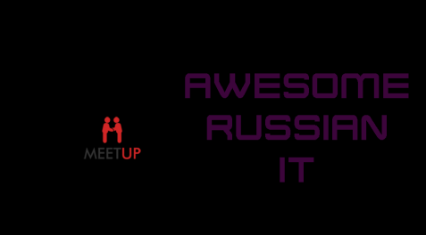
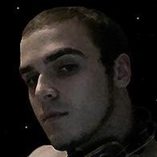
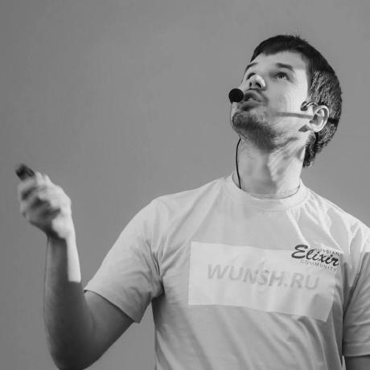

  

---

<h5 align="center">Здесь собран список полезных русскоязычных ресурсов, связанных с информационными технологиями (разработка, администрирование, митапы и конференции, интервью, новости ИТ и пр.).</h5>

> Ежедневно автоматически обновляются данные о количестве подписчиков, количестве видео и дате последнего видео для [YouTube-каналов](YouTube.md), а также о количестве эпизодов и дате релиза последнего эпизода для [подкастов](Podcasts.md).

## Статус обновления

|Раздел|Статус|Telegram-канал|
|:----:|:----:|:-------------|
|Podcasts||[@awesome_russian_podcasts](https://t.me/awesome_russian_podcasts) - здесь периодически вместе с обновлением файла ([Podcasts.md](Podcasts.md)) репозитория публикуются новые выпуски подкастов, добавленные с прошлого обновления.|
|YouTube||[@awesome_russian_youtube](https://t.me/awesome_russian_youtube) - здесь периодически вместе с обновлением файла ([YouTube.md](YouTube.md)) репозитория публикуются новые видео из YouTube-каналов, добавленные с прошлого обновления.|

---

## Содержание

Также вы можете посмотреть [список русскоязычных Подкастов](Podcasts.md) и [список русскоязычных YouTube-каналов](YouTube.md), связанных с ИТ (расположены в отдельных файлах).

|
**[Блоги](#блоги)**
|
**[Мероприятия](#мероприятия)**
|
**Прочее**
|
|:-|:-|:-|
|&nbsp;•&nbsp;[Администрирование](#blogs-administrating) &nbsp;•&nbsp;[Документация](#blogs-documentation) &nbsp;•&nbsp;[Общее](#blogs-common) &nbsp;•&nbsp;[Паттерны](#blogs-patterns) &nbsp;•&nbsp;[Тестирование](#blogs-testing) &nbsp;•&nbsp;[.NET](#blogs-dotnet) &nbsp;•&nbsp;[GameDev](#blogs-gamedev) &nbsp;•&nbsp;[Java](#blogs-java) &nbsp;•&nbsp;[Go](#blogs-go) &nbsp;•&nbsp;[Python](#blogs-python)|&nbsp;•&nbsp;[Агрегаторы и Общие](#meetups-aggregators) &nbsp;•&nbsp;[Аналитика](#meetups-analytics) &nbsp;•&nbsp;[БД](#meetups-db) &nbsp;•&nbsp;[AI](#meetups-ai) &nbsp;•&nbsp;[Architecture](#meetups-architecture) &nbsp;•&nbsp;[BlockChain](#meetups-blockchain) &nbsp;•&nbsp;[BigData и DataScience](#meetups-bigdata-datascience) &nbsp;•&nbsp;[Development](#meetups-development) &nbsp;&nbsp;&nbsp;•&nbsp;[1C](#meetups-development-1c) &nbsp;&nbsp;&nbsp;•&nbsp;[.NET](#meetups-development-dotnet) &nbsp;&nbsp;&nbsp;•&nbsp;[C++](#meetups-development-cpp) &nbsp;&nbsp;&nbsp;•&nbsp;[Elixir](#meetups-development-elixir) &nbsp;&nbsp;&nbsp;•&nbsp;[GameDev](#meetups-development-gamedev) &nbsp;&nbsp;&nbsp;•&nbsp;[Go](#meetups-development-go) &nbsp;&nbsp;&nbsp;•&nbsp;[IoT](#meetups-development-iot) &nbsp;&nbsp;&nbsp;•&nbsp;[Java](#meetups-development-java) &nbsp;&nbsp;&nbsp;•&nbsp;[Kotlin](#meetups-development-kotlin) &nbsp;&nbsp;&nbsp;•&nbsp;[Mobile](#meetups-development-mobile) &nbsp;&nbsp;&nbsp;•&nbsp;[MR VR AR](#meetups-development-mr-vr-ar) &nbsp;&nbsp;&nbsp;•&nbsp;[PHP](#meetups-development-php) &nbsp;&nbsp;&nbsp;•&nbsp;[Python](#meetups-development-python) &nbsp;&nbsp;&nbsp;•&nbsp;[Ruby](#meetups-development-ruby) &nbsp;&nbsp;&nbsp;•&nbsp;[Scala](#meetups-development-scala) &nbsp;&nbsp;&nbsp;•&nbsp;[Web](#meetups-development-web) &nbsp;&nbsp;&nbsp;•&nbsp;[DevOps](#meetups-devops) &nbsp;&nbsp;&nbsp;•&nbsp;[Management](#meetups-management) &nbsp;•&nbsp;[Security](#meetups-security) &nbsp;•&nbsp;[Testing и QA](#meetups-testing-qa) &nbsp;•&nbsp;[UX](#meetups-ux)|&nbsp;•&nbsp;[Подкасты (в отдельном файле)](https://github.com/unchase/awesome-russian-it/blob/master/Podcasts.md) &nbsp;•&nbsp;[YouTube-каналы (в отдельном файле)](https://github.com/unchase/awesome-russian-it/blob/master/YouTube.md) &nbsp;•&nbsp;[Информация для авторов ресурсов](#информация-для-авторов-ресурсов) &nbsp;•&nbsp;[Контрибьюторы](#контрибьюторы)|

## **Блоги**

[Содержание](#содержание)

> Здесь представлены различные блоги и новостные агрегаторы, связанные с разработкой и со сферой ИТ в целом.

<b>Администрирование</b>
 

[Содержание](#содержание)

|Название|Описание|Автор/Создатель|
|:-------|:-------|:--------------|
|**[Записки админа](https://sysadmin.pm/)**|Заметки сисадмина — это сборник записей системного администратора, который уже несколько лет работает с Linux на серверах.|  |
|**[LINUX.ORG.RU](https://www.linux.org.ru/)** |Проект «LINUX.ORG.RU: Русская информация об ОС Linux» был основан в октябре 1998 года. Нашей целью является создание основного информационного ресурса об операционной системе Linux в России. Мы стараемся обеспечить возможность обмена различной Linux-ориентированной информацией, последними новостями, ссылками, документацией и другими ресурсами.|[Максим Валянский (maxcom)](https://valyanskiy.net/)  |

<b>Документация</b>
 

[Содержание](#содержание)

|Название|Описание|Автор/Создатель|
|:-------|:-------|:--------------|
|**[docops-hq.github.io](https://docops-hq.github.io/conf/)** |Сайт с конспектами выступлений по документированию с различных конференций.|Николай Волынкин |
|**[Lana Teletype.in](https://teletype.in/@lananovikova)**|Дайджесты чата Docops с полезной информацией по документированию.|[Светлана Новикова](https://lananovikova.tech/)  |
|**[Learnapidoc-ru 2.0](https://starkovden.github.io/)**|Курс по документированию API. Вольный перевод курса [Documenting APIs: a guide for technical writers](https://idratherbewriting.com/learnapidoc/), составленного Томом Джонсоном, техническим писателем Amazon.|Tom Johnson Переводчик: |

<b>Общее</b>
 

[Содержание](#содержание)

|Название|Описание|Автор/Создатель|
|:-------|:-------|:--------------|
|**[Блог Александра Бындю](https://blog.byndyu.ru/)**|Личный блог Александра Бындю, IT-архитектора и эксперта в Agile и Lean.|[Личный сайт](https://byndyu.ru/)   |
|**[Блог Хекслета](https://ru.hexlet.io/blog)**       |Лучшие статьи от Хекслета раз в неделю о разработке, карьере и обучении. Хекслет — практические курсы по программированию. Мы помогаем новичкам стать профессиональными программистами, а опытным разработчикам получать новые знания и расти профессионально.||
|**[Хабр](https://habr.com)**     |Крупная площадка с многомиллионной аудиторией и необычными сервисами. На Хабре ​ведут ​блоги ​известные ​компании. ​Они делятся ​знаниями, ​опытом ​и узнают ​мнение ​о своих ​продуктах ​из первых ​рук, ​а пользователи ​задают ​им вопросы ​напрямую ​и получают ​ответы.||
|**[learnxinyminutes.com](https://learnxinyminutes.com/)** |Документация как код к множеству языков и инструментов, собранная сообществом. Есть статьи на русском языке.|[Adam Bard](https://adambard.com/) |
|**[Metanit.com](https://metanit.com/)**|Курсы по программированию по различным языкам и технологиям программирования от METANIT.COM.||
|**[RSDN](http://rsdn.org/)**   |RSDN создан программистами для программистов. Главная цель создателей сайта заключается в том, чтобы хоть как-то компенсировать нехватку материалов по программированию на русском языке. Сейчас в конференциях можно часто слышать, что "Кто не знает английского, тот не программист". Понимая чудовищную несправедливость такого положения вещей, мы и решили создать RSDN. Здесь вы найдёте статьи по самой различной тематике, ответы на вопросы, полезные утилиты, готовые компоненты и многое другое. К вашим услугам коллекция ссылок на другие сайты в Сети, которые могут вам пригодиться, перечень книг, журналов, рассылок, конференций и других ресурсов, посвящённых программированию. На нашем сайте вы сможете пообщаться с авторами статей или задать коллегам в одном из форумов трудный вопрос, на который вам непременно ответят.||

<b>Паттерны</b>
 

[Содержание](#содержание)

|Название|Описание|Автор/Создатель|
|:-------|:-------|:--------------|
|**[Рефакторинг.Гуру](https://refactoring.guru/ru)**  |Рефакторинг.Гуру посвящён тёмным материям программирования: рефакторингу, паттернам проектирования, принципам SOLID и другим важным темам из мира программирования. Главная цель этого сайта — показать общую картину того, как все эти темы пересекаются, как работают вместе и насколько они до сих пор актуальны.|Александр Швец  |

<b>Тестирование</b>
 

[Содержание](#содержание)

|Название|Описание|Автор/Создатель|
|:-------|:-------|:--------------|
|**[Блог a1qa](https://www.a1qa.ru/blog/)**|Блог о тестировании и качестве ПО.| |
|**[Жизнь - это движение! А тестирование - это жизнь!](http://okiseleva.blogspot.com/)** |Личный блог Ольги Назиной (Киселевой) по тестированию и не только.|Ольга Назина (Киселева)|
|**[automated-testing.info](https://automated-testing.info/)**       |Портал, который ставит перед собой цель соединить информацию и специалистов в области автоматизации тестирования программного обеспечения.|[Михаил Поляруш](http://poliarush.com) |
|**[OpenQuality.ru](http://blog.openquality.ru/)** |Цель проекта - способствовать улучшению качества программного обеспечения. Держать руку на пульсе событий, отслеживать тенденции в создании информационных систем и делиться практическим опытом внедрения новых технологий.|Юрий Кунивер|
|**[Software-Testing.RU blogs](https://software-testing.ru/blogs)** |Проект Software-Testing.RU посвящён вопросам тестирования и повышения качества программного обеспечения. На нашем портале специалисты по тестированию смогут найти сотни тематических статей, подборку книг по тестированию, обзор новостей отрасли. В разделе Тренинги собрана информация об учебных курсах и тренингах по тестированию, конференциях и других мероприятиях проводимых в России и СНГ разными компаниями.|  |

<b>.NET</b>
 

[Содержание](#содержание)

|Название|Описание|Автор/Создатель|
|:-------|:-------|:--------------|
|**[Блог Андрея Акиньшина](https://aakinshin.net/ru/posts/)** |Блог Андрея Акиньшина — разработчика и учёного, частого спикера на конференциях, автора постов и статей. Он мейнтейнер [BenchmarkDotNet](https://github.com/dotnet/BenchmarkDotNet) (самая популярная библиотека для написания .NET-бенчмарков) и автор [Pro .NET Benchmarking](https://aakinshin.net/prodotnetbenchmarking/) (книга о практиках замеров производительности).|    |
|**[Блог Андрея Амельченя](http://flash2048.com/)** |Мысли и статьи о программировании и не только.|  |
|**[Блог Дмитрия Нестерука](https://nesteruk.wordpress.com/)**|Блог о программировании — C#, F#, C++, архитектура, и многое другое.|  |
|**[Блог Дмитрия Сошникова](https://soshnikov.com/blog/)**|Личный блог Дмитрия Сошникова, технологического евангелиста в компании Майкрософт.|Дмитрий Сошников   |
|**[Блог Сергея Теплякова](http://sergeyteplyakov.blogspot.com/)** |Личный блог Сергея Теплякова, автора книги "Паттерны проектирования на платформе .NET".|Сергей Тепляков    |
|**[Andrey on .NET](https://andrey.moveax.ru/)** |Про C#, .NET, ASP.NET, Core, MVC, Azure, EF, IoC и другие умные слова.|Андрей Веселов  |
|**[Code Instinct](https://www.codeinstinct.pro/)** |Блог Дмитрия Петухова, консультанта по технологиям машинного обучения, Cloud-архитектора, спикера, неутомимого исследователя и кофемана.|  |
|**[it-community.in.ua](https://it-community.in.ua/)** |Проект «ИТ сообщество Украины» основан в начале 2014 года c целью создания информационно-коммуникационного ресурса, на котором ИТ-специалисты разного уровня смогут получить актуальную информацию о различных продуктах, а также особенностях их конфигурирования.||
|**[Wiki .NET сообществ в GitHub](https://github.com/AnatolyKulakov/SpbDotNet/wiki)**|Wiki в GitHub с записями встреч и презентациями русскоязычных .NET сообществ с наиболее полной информацией о них.|[Анатолий Кулаков](https://github.com/AnatolyKulakov/SpbDotNet/wiki/Anatoly-Kulakov)  |

<b>GameDev</b>
 

[Содержание](#содержание)

|Название|Описание|Автор/Создатель|
|:-------|:-------|:--------------|
|**[App2Top.ru](https://app2top.ru/)**    |App2Top.ru – это информационный ресурс, посвященный всем аспектам индустрии игр. Последние новости разработки и продвижения игр, интервью с лидерами рынка, постмортемы кассовых хитов и советы по игровому дизайну, – все это, а также многое другое можно найти на App2Top.ru.||
| [Dat Fest](http://datfest.ru/)|Dat Fest — это фестиваль про игры и гик-культуру в целом. Фестиваль, который посвящен всему и сразу, но в первую очередь — играм, и даже старым играм. У нас будут разработчики, интервью с известными актерами озвучки тех самых игр, турниры, традиционное и большое косплей-дефиле, мастер-классы, лекции и прочее.|Москва||
|**[DevTribe](https://devtribe.ru)**    |DevTribe - это сайт об инди-играх, объединяющий людей, которые делают инди-игры, с теми, кто в эти инди-игры играет. Мы собираем в одно пространство все части gamedev'а: новости об инди-играх и разработке игр, поиск работы в игровой индустрии, база знаний по игровым инструментами и движкам, инструментарий для разработки игр, и, конечно же, возможность организовать место для дневника разработчика.|Александр Jusper Николаев|
|**[DTF](https://dtf.ru/)**       |DTF — это платформа для обсуждения игр, кино, разработки и технологий. У площадки нет консолидированной позиции, здесь собираются люди с разными мнениями и взглядами на одни и те же продукты развлекательной индустрии.||
| [Games Conventions](https://games-conventions.ru/catalogue)|Календарь игровых мероприятий всего мира, в т.ч. геймдева.|Весь мир|   |
|**[Indie.by](http://www.indie.by)**   |Indie.by — блог о независимых играх. Этот блог создан в поддержку всех независимых игр. Здесь Вы можете найти или спросить всю интересующую вас информацию о проектах, созданных без влияния крупных компаний. В статьях освещаются темы, затрагивающие как игры, так и мероприятия, фильмы об играх, тематические интернет-ресурсы, музыку и многое другое.|Максим Павлов|
|**[XYZ](https://www.school-xyz.com/blog)**      |Блог школы онлайн курсов для успешной карьеры в индустрии игр, кино и искусства.||
|**[Блог Алисы Высотиной](https://mistle-gamer.livejournal.com/)** ||Алиса Высотина|
|**[Блог Михаила Кадикова](http://level-design.ru/)**  |Личный блог Михаила Кадикова, профессионального дизайнера уровней из России.|Михаил Кадиков|
|**[Манжеты гейм-дизайнера](https://gdcuffs.com)**      |Манжеты гейм-дизайнера — профессиональный блог об игровой индустрии и гейм-дизайне в частности.|Ник Филатов Владимир Ковтун Артём волков Сергей Гимельрейх Алексей Корогодин Алёна Пономаренко Барисби Алборов Григорий Чопоров Антон Токарев|

<b>Go</b>
 

[Содержание](#содержание)

|Название|Описание|Автор/Создатель|
|:-------|:-------|:--------------|
|**[4gophers](https://4gophers.ru/)**     |Блог по языку программирования Go/Golang.||

<b>Java</b>
 

[Содержание](#содержание)

|Название|Описание|Автор/Создатель|
|:-------|:-------|:--------------|
|**[miniJUG](https://minijug.ru/)**  |Новости из мира Java.||

<b>Python</b>
 

[Содержание](#содержание)

|Название|Описание|Автор/Создатель|
|:-------|:-------|:--------------|
|**[Блог Антона Жиянова](https://antonz.ru/)**   |Личный блог Антона Жиянова о Python и разработке продуктов.|Антон Жиянов|

---

## **Мероприятия**

[Содержание](#содержание)

> Здесь собраны агрегаторы всевозможных мероприятий (конференций, митапов, хакатонов и встреч), сообщества и компании, проводящие их, и связанные с ИТ тематикой.

<b>Агрегаторы и Общие</b>
 

[Содержание](#содержание)

|Название|Описание|Места проведения мероприятий|Связанные ссылки|
|:------:|:-------|:--------------------------:|:--------------:|
| [#tceh](https://tceh.com/events/)|Каждый год #tceh проводит экспертные, образовательные и комьюнити-события — от камерных, на несколько человек, до сверхпопулярных, на сотни участников.|Москва|     |
| [2035.events](https://2035.events/)|Календарь IT-мероприятий.|Россия||
| [2event.com](https://2event.com/ru/events?event_name=&category=2&city=all&date_range=all&date_from=&date_to=&all=on)|2Event - это сайт и бесплатное мобильное приложение для организаторов событий и посетителей.|Украина|    |
| [404fest](https://404fest.ru)|Фестиваль деятелей интернета. Культовый фестиваль, где каждую осень 1500 топовых деятелей IT обмениваются опытом, обсуждают будущее индустрии и отрываются на безудержной афтерпати.|Самара|    |
| [8d9.ru](https://8d9.ru/it-events)|Айти от Олега Солозобова.|Онлайн||
| [all-events.ru](https://www.all-events.ru/events/calendar/theme-is-informatsionnye_tekhnologii/)|Проект All-Events был создан как площадка, где можно найти самую полную и подробную информацию о бизнес-событиях России, стран СНГ и Зарубежья. Имея более чем 10 –летний опыт организации и проведения бизнес мероприятий самого разного формата от конференций до семинаров,  мы знаем все «подводные камни» этого рынка и хотим внести свой вклад в его развитие.|Россия|   |
| [allcio.ru](https://www.allcio.ru/news-company/events/)|Анонсы и отчеты по мероприятиям ИТ компаний.|Россия и страны бывшего СНГ|  |
| [atawaka.com](https://atawaka.com/msk/conferences-forums/)|atawaka — это путеводитель по событиям, в том числе и в ИТ-сфере. Сайт atawaka представляет собой новостную ленту событий, с их подробным описанием. Организаторы самостоятельно размещают анонсы событий на сайте, тем самым приглашают посетителей принять в них участие. В какой-то степени atawaka — это социальная сеть, основными аккаунтами которой являются сами события. Посетители при желании могут общаться с организаторами, оставлять комментарии и ставить оценки, тем самым повышая качество организовываемых мероприятий. Зарегистрированные пользователи по календарю избранных событий могут легко и эффективно планировать досуг или путешествие на многие месяцы вперед.|Москва, Санкт-Петербург|  |
| [Atlassian](https://ace.atlassian.com/events/#/list)|Мероприятия, связанные с продуктами Atlassian.|Весь мир||
| [Avito Tech](https://tech.avito.ru/events/)|IT-события, проводимые Авито.|Москва, Казань|      |
| [awara-it.com](https://awara-it.com/ru/events-2/)|Awara IT – один из самых активных партнеров Microsoft. Мы развиваем сообщество Microsoft Dynamics в России и выступаем на российских и международных мероприятиях Microsoft – Directions, NAV Tech Days, Insider DevTour. Мы проводим локальные мероприятия для бизнес-пользователей системы, так и для технических специалистов. Консультанты Awara IT ведут блоги, выступают экспертами форума Dynamics 365 Community.|Весь мир|   |
| [CNews Conferences](https://events.cnews.ru/upcoming)|CNews Conferences /CNC/ устраивает как разовые мероприятия на актуальные темы, так и ежегодные мероприятия, ставшие постоянным местом встреч профессионалов: CNews AWARDS, CNews FORUM, круглые столы, пресс-конференции, партнерские конференции, expo-days, power breakfast и любой другой формат бизнес-мероприятия.|Москва|     |
| [Code Battle](http://codebattle.ru/#events)|Данное сообщество специализируется на создании AI-ботов в рамках соревнования программистов. Таким образом мы обеспечиваем применение и демонстрацию полученных знаний в виде интересного индивидуального и командного соревнования по написанию AI. В данных соревнованиях могут участвовать любые категории программистов, которые хотят продемонстрировать свои умения. Сами мероприятия проводятся примерно 2-3 раза в год.|Россия|     |
| [Codefest](https://codefest.ru/)|Крутейшая за Уралом конференция разработчиков, тестировщиков, дизайнеров, менеджеров проектов и продуктов.|Новосибирск|      |
| [comaqa.by](https://comaqa.by/category/news/events/)|Площадка для эффективного общения всех IT-специалистов в контексте автоматизированного тестирования. Мы — IT-профессионалы: разработчики, тестировщики, автоматизаторы, менеджеры, специалисты по продажам. Сотрудники ведущих компаний, тренера, консультанты, участники международных конференций. Наша цель - создать единую площадку для эффективного общения всех IT-специалистов в контексте автоматизированного тестирования.|Россия, Белоруссия|   |
| [community-z.com](https://community-z.com/events)|Вместе мы Сообщество-Z! Z - это место для любого инженера из любого домена, страны или компании. Здесь вы можете разместить свое сообщество, пригласить докладчиков, пообщаться со своей аудиторией, создать сети, поделиться знаниями и сотрудничать с другими экспертами и сообществами.|Весь мир|  |
| [Computer Science клуб](https://compsciclub.ru/schedule/)|Computer Science клуб — это открытые лекции и курсы. В клубе любой желающий может познакомиться с классическими результатами, современным положением дел и открытыми задачами в различных областях Computer Science. Вход на лекции свободный, регистрация не требуется, посещать курсы можно начать в любое время.|Санкт-Петербург, Новосибирск, Казань|     |
| [confa.in.ua](https://www.confa.in.ua/events)|Конференции Украины.|Украина| |
| [conferencecast.tv](https://www.conferencecast.tv/ru/events)|Записи докладов с лучших отраслевых конференций.|Весь мир|   |
| [ContentSense](https://contentsense.ru)|Конференция о контенте, который помогает продвигать продукты. Конференция, на которой мы обсудим, как создавать качественный контент и как эффективно использовать его для увеличения прибыли компаний. Со сцены, в кулуарах, на вечеринке.|Москва|  |
| [d-russia.ru](http://d-russia.ru/km)|На этой странице собрана информация о всех значимых мероприятиях в сфере информационных технологий, в том числе связанных с государственной, региональной и муниципальной информатизацией.|Россия|     |
| [dataart.ru](https://dataart.ru/events)|Мероприятия DataArt. DataArt с 1997 года проектирует, разрабатывает, модернизирует и поддерживает IT-решения в области финансов, здравоохранения, туризма, медиа и интернета вещей.|Весь мир|         |
| [Dataline](https://uni.dtln.ru/courses)|Курсы и семинары университета Dataline.|Онлайн||
| [dev.by](https://events.dev.by/)|dev.by — медиа об ИТ-индустрии в Беларуси и мире. Публикуем экспертную информацию об ИТ с 2008 года. Делаем новости, интервью, репортажи, аналитику. Собираем каталог белорусских ИТ-компаний и отзывы о них. Ведём самый полный календарь ИТ-событий и статистику зарплат, размещаем вакансии.|Белоруссия|          |
| [Dev2Dev](http://dev2dev.ru/)|Dev2Dev - это регулярные конференции от разработчиков для разработчиков. Dev2Dev - это общение, фан, много мотивации, реальный опыт и живые знания.|Россия|  |
| [devart.com](https://www.devart.com/events)|Devart основана в 1997 году и является одним из ведущих поставщиков инструментов для разработки, администрирования и управления базами данных, ALM решений, и компонентов доступа к данным для различных серверов.|Украина|   |
| [Developers Republic](http://devrepublic.tech/event)|Developers Republic - сообщество созданное для программистов из Донецкого региона с целью общения, обмена опытом и новой информацией из мира IT. Это сообщество будет полезно для программистов и всех, кто связан с миром разработки.|Донецк| |
| [devsday.ru](https://devsday.ru/event/list)|DevsDay.ru - это сайт для поиска работы и специалистов в сфере IT-технологий. Большинство наших посетителей являются квалифицированными специалистами: разработчиками, QA и DevOps-инженерами, тимлидами и проектными менеджерами. Мы рассказываем о последних IT-новостях в России и Мире.  На страницах нашего сайта публикуются статьи о технологиях, стартапах, компаниях, мероприятиях и многом другом.|Россия, Белоруссия, Казахстан, Украина|   |
| [DevTalk by dev-pro.net](https://devtalk.dev-pro.net/ru/) |DevTalk — новая площадка для разработчиков, целью которой является собрать профессионалов в сфере разработки программного обеспечения для обмена опытом и обсуждения актуальных вопросов.|Украина|  |
| [digest.pro](https://www.digest.pro/calendar/)|Календарь актуальных IT-событий.|Украина|   |
| [dou.ua](https://dou.ua/calendar/)|Календарь ИТ-событий Украины.|Украина| |
| [dru.io](http://dru.io/events)|Dru.io — место, где вы можете задать интересующие вас вопросы по Drupal, пообщаться с профессиональными разработчиками, получить бесплатную поддержку, узнать самую свежую информацию и стать частью нашего дружного сообщества.|Россия|   |
| [DTR](http://dtr.moscow)|Ежегодная конференция Digital Transformation in Russia — это свежие кейсы, спикеры-практики, инновационные решения и стратегические сессии с участием digital-экспертов. Площадка для обмена опытом и практическими решениями цифровизации. DTR - возможность увидеть и обсудить реальные digital-проекты в области управления бизнесом, принятия решений на основе данных, внедрения инноваций и автоматизации рутинных процессов. Мы изучаем кейсы цифровизации российских компании и обсуждаем, как изменить и оптимизировать бизнес в России здесь и сейчас.|Москва||
| [Dvoma.Pro](https://dvoma.pro)|Международная ИТ-конференция Dvoma.Pro посвящена привлечению и монетизации трафика в интернете. На ней затрагиваются такие темы, как партнерские программы, поисковое продвижение сайтов, контекстная реклама, аналитика, социальные сети и лидогенерация. Спикеры – практикующие эксперты со всего мира, только работающие кейсы!|Украина, Онлайн|   |
| [edumarket.ru](http://edumarket.ru/)|Каталог курсов, программ, семинаров, тренингов. Благодаря нашему сервису, вы можете выбрать и сравнить по ценам, скидкам и отзывам курсы повышения квалификации, семинары, тренинги из огромного множества актуальных образовательных программ в Москве, Санкт-Петербурге, Новосибирске, Екатеринбурге и еще в 308 городах России и за рубежом.|Россия| |
| [EPAM Group](https://www.epam-group.ru/about/who-we-are/events)|Мероприятия, проводимые EPAM.|Весь мир|  |
| [expomap.ru](https://expomap.ru/conference/theme/it-razrabotka-po/)|Expomap – самый посещаемый в России и СНГ каталог выставок и конференций с более чем 500 000 просмотров страниц в месяц. С помощью нашего ресурса мы хотим упростить подбор качественных мероприятий для малого и среднего бизнеса.|Весь мир|      |
| [expotrade.ru](https://expotrade.ru/)|Афиша деловых мероприятий.|Россия, Украина|  |
| [First IT Holywar Conference](http://human2it.com/)|Конференция про тёмную сторону ИТ.|Минск||
| [FPURE](https://www.fpure.events/)|Fpure — конференция по функциональному программированию.|Россия||
| [fwdays.com](https://fwdays.com)|Профессиональные конференции (JS, PHP, .NET, PM, Highload) для разработчиков в Украине.|Киев|    |
| [GEEK PICNIC](https://geek-picnic.me/earlybird)|GEEK PICNIC — крупнейший в мире open air, посвященный науке и технологиям. Каждое лето мы собираем на своих площадках экспертов со всего мира — ученых, инженеров, изобретателей, художников-визионеров, чтобы попробовать приоткрыть завесу в таинственный мир будущего.|Москва, Санкт-Петербург|  |
| [Google Developers](https://developers.google.cn/events?hl=ru)|Мероприятия сообщества Google Developers (ресурс на английском языке, но есть мероприятия, проходящие в России).|Весь мир|   |
| [GuruConf](https://guruconf.com/)|GuruConf - масштабная конференция о Digital Marketing! GuruConf - это конференция об успешных кейсах бизнеса в интернете, о рисках и потерях, и как от них защититься, о лидогенерации и продажах. Среди спикеров только успешные реально практикующие эксперты. Все доклады ориентированы исключительно на практическое применение, внедрение и основаны на реальном жизненном опыте.|Киев|  |
| [Hydra](https://hydraconf.com/)|Hydra — конференция, посвященная разработке параллельных и распределенных систем. В программе конференции доклады от основоположников теорий распределенных систем и инженеров, работающих с ними на проде.|Москва|   |
| [ict.moscow](https://ict.moscow/events/)|ICT.Moscow — открытая платформа о цифровых технологиях в Москве. Мы создаем наиболее полную картину развития рынка технологий в городе и за его пределами, помогаем бизнесу следить за главными трендами, не упускать возможности и находить новых партнеров.|Москва|   |
| [ICT2GO](https://ict2go.ru/events/)|Портал ICT2GO.ru является крупнейшим по охвату агрегатором мероприятий по тематике информационных технологий, телекоммуникаций и смежных отраслей (гаджеты, оборудование, технологии, финтех, кадры, маркетинг и т.д.), включая вертикали (ИТ в банках, ИТ в ритейле и т.д.) в российском сегменте Интернета. Проект аккумулирует и предоставляет своим посетителям наиболее полную базу ИКТ-мероприятий: от крупных конференций до вебинаров отдельных компаний и региональных событий. Также сервис отслеживает и значимые зарубежные ивенты.|Весь мир|  |
| [iot.ru](https://iot.ru/events/)|Мероприятия и новости Интернета вещей.|Москва, Санкт-Петербург|     |
| [IT BDSMinsk](https://www.bds.marketing/)|Международная конференция по business development, sales, marketing, product management и launch.|Минск|   |
|IT Meeting|Публикую мероприятия для разработчиков на своем канале в телеграме [itmeeting.ru](https://itmeeting.ru/) На хабре делаю подборки ближайших событий, если такие есть (пс. перед новогодними праздниками и в летнее время такие мероприятия в дефиците).|Москва| |
| [it-cluster.if.ua](http://it-cluster.if.ua/events/)|Ивано-Франковский ИТ кластер - группа инициативных людей, которые объединились, на общественных началах, для развития ИТ отрасли Ивано-Франковск.|Ивано-Франковск (Украина)| |
| [it-conf.ru](https://it-conf.ru/ru/index)|Конференции для профессионалов индустрии информационных технологий.|Весь мир|  |
| [IT-Events](https://it-events.com/)|Конференции, митапы, хакатоны, тренинги, олимпиады, форумы... в сфере информационных технологий, робототехники и телекома.|Россия и страны бывшего СНГ|    |
| [IT-People.ru](https://www.it-people.ru/)|Организуем конференции DUMP, PyCon Russia, FailConf, CONVERT.|Весь мир|   |
| [it-world.ru](https://www.it-world.ru/news-company/events/)|Анонсы и отчеты по мероприятиям ИТ компаний.|Россия|  |
| [ITGLOBAL.COM](https://itglobal.com/ru-ru/company/events/)|Компания ITGLOBAL.COM принимает активное участие в мероприятиях, посвященных теме информационных технологий. Также специалисты компании проводят семинары на базе Центра компетенции ITGLOBAL.COM.|Онлайн|    |
| [IT Global Meetup](https://piter-united.ru/)|Слет IT-сообществ Петербурга. Мы — объединение активистов ИТ-сообществ формирующих и развивающих профессионально-образовательную инфраструктуру в Санкт-Петербурге на базе сообществ.|Санкт-Петербург|     |
| [IT Shark](https://it-shark.pro/)|Независимое профессиональное сообщество разработчиков IT Shark - конференции, тренинги, менторинг, митапы, хакатоны, встречи и, конечно, афтепати в Беларуси.|Белоруссия|        |
| [IT Way](https://it-way.pro/)|Скилл-шеринг сообщество IT Way - это cообщество, команда которого  делает образовательные конференции без серьёзных щей почти каждые 2 недели в разных городах России, а так же Большой Форум в Ульяновске на 5 дней каждый октябрь.|Ульяновск, Томск, Казань, Пермь, Самара, Москва|     |
| [it52.info](https://www.it52.info/events)|it52 — это некоммерческое сообщество энтузиастов, которые думают, что могут сделать жизнь нижегородского айтишника немного лучше. Мы помогаем организовывать профильные мероприятия, ведём афишу событий, курируем несколько чатиков в телеграме и групп в соцсетях, и кажется, что у нас получается.|Нижний Новгород|     |
| [it61.info](https://it61.info/events)|Ростовское IT-сообщество.|Ростов-на-Дону|       |
| [itcloud.academy](https://itcloud.academy/events/)|IT Cloud Academy — это уникальное пространство обучения и обмена опытом, объединяющее студентов и профессионалов IT/Digital сфер Харькова.|Харьков (Украина)|   |
| [itsmforum.ru](http://www.itsmforum.ru/events/)|События сообщества профессионалов ITSM.|Россия|   |
| [JetBrains Events](https://www.jetbrains.com/company/events/)|Мероприятия JetBrains проводятся по всему миру с участием гостей из местного сообщества и докладчиков JetBrains. Узнайте о последних разработках и передовых практиках, как максимально эффективно использовать свои инструменты.|Весь мир|[JetBrains Blog](https://blog.jetbrains.com)        |
| [JetInfo](https://www.jetinfo.ru/meropriyatiya/)|Миссия JETINFO — делиться с бизнесом реальными ИТ-инсайдами. Мы изнутри и досконально знаем ИТ-рынок, сами формируем его уже более двух десятков лет — реализуем несколько сотен проектов ежегодно, нам известны детали закрытых для остальной прессы кейсов. Этот уникальный для рынка практический опыт мы транслируем через наш журнал.|Москва|    |
|  [JUG RU Group](https://jugru.org/)|Мы делаем крупнейшие в России конференции и митапы для программистов. Наша цель – развитие российского сообщества разработчиков путем создания специализированных площадок для обмена опытом и нетворкинга среди программистов высокого уровня. Поэтому наши программы состоят только из технических докладов и сформированы таким образом, чтобы собирать и объединять энтузиастов-разработчиков, готовых обмениваться опытом и обсуждать решения прикладных задач и проектов.|Москва, Санкт-Петербург, Новосибирск|    |
| [Kaspersky](https://careers.kaspersky.ru/events/)|Мероприятия, проводимые АО «Лаборатория Касперского».|Россия|       |
| [Kharkiv IT Cluster](https://it-kharkiv.com/ru/events/)|Kharkiv IT Cluster — харьковская общественная организация, которая с 2015 года объединяет ведущие IT-компании, местные власти и высшие учебные заведения для внедрения комплексных изменений в IT-экосистему города. Цели организации — сформировать в Харькове благоприятную для IT-бизнеса среду, продвигать город как ведущую IT-локацию, поддерживать IT-community и образование. Миссия организации: постепенная трансформация Харькова в IT-центр международного масштаба.|Харьков (Украина)|     |
|[krd.dev](https://krd.dev/)|Независимое сообщество разработчиков Краснодара и края.|Краснодар|      |
| [Leader ID](https://leader-id.ru/events/)|Календарь мероприятий информационной системы поддержки лидеров.|Россия||
| [Mail.ru Group](https://corp.mail.ru/ru/press/events/)|События Mail.ru Group.|Москва|     |
| [Meetup.com](https://www.meetup.com/ru-RU/)|Meetup — это платформа для поиска и создания местных сообществ. Хотите найти друзей, научиться чему-то новому, получить поддержку, выйти из зоны комфорта и заняться любимым делом вместе с единомышленниками? Присоединяйтесь к Meetup.|Россия|    |
| [meetups-online.ru](https://meetups-online.ru/)|Онлайн-митапы с живым общением. Многие талантливые и опытные эксперты живут вдали от больших митапов. Во многих городах нет своих сообществ или они собираются редко. Айтишники, которым есть чем поделиться или хочется подискутировать, есть почти везде. А еще у нас тут к-о-в-и-д. Здесь мы собираем ссылки для тех, кому интересно попробовать формат онлайн-митапов как докладчику и как слушателю с правом голоса.|Онлайн||
| [Monhouse](https://monhouse.tech/calendar)|ДОМ МОНИТОРИНГОВЫХ ТЕХНОЛОГИЙ. Место, где собираются люди и знания по вопросам мониторинга и автоматизированного управления.|Весь мир|    |
| [MY.TECH](http://www.fest-my.tech/)|MY.TECH – площадка для демонстрации инновационных решений, готовых к внедрению в бизнес, промышленность, образование, культуру, городскую среду и повседневную жизнь горожан.|Санкт-Петербург| |
| [nexign](https://nexign.com/ru/newsroom/events)|Nexign, ведущий поставщик систем поддержки бизнеса (Business Support System) и платформ интернета вещей (Internet of Things) для операторов связи, с 1992 года разрабатывает практичные решения, ориентированные на снижение совокупной стоимости владения для клиентов.|Весь мир|    |
| [Odessa Frontend Community](https://odessafrontend.com/)|Фронтенд-комьюнити Одессы.|Одесса|   |
|  [Ontiko](http://ontico.ru/)|Конференции Олега Бунина.|Москва, Санкт-Петербург|  |
| [Open IT](http://openit.by/)|Ежегодная профориентирующая и обучающая конференция.|Белоруссия||
| [osp.ru](https://www.osp.ru/events-agenda/)|Сегодня OSP является организатором многочисленных конференций для отечественного ИКТ- и бизнес-сообщества. Основной акцент своей деятельности OSP делает на детальной проработке контентной составляющей проводимых мероприятий, начиная с определения тематики конференции и кончая предоставлением ее участникам собственной аналитической экспертизы. Именно это обстоятельство сделало конференции, проводимые OSP, заметным явлением на российском рынке и позволило занять на нем ведущие позиции.|Россия|    |
| [OZON Tech](https://ozon.dev/home/#calendar)|В свободное от e-commerce время мы проводим собственные митапы и конференции или выступаем в гостях. Здесь будут события, где можно встретиться и познакомиться с командой Ozon.|Москва| |
| [Panda Meetup](https://panda-meetup.ru/)|Мероприятия образовательного проекта российского IT-сообщества.|Россия|    |
| [proglib.io](https://proglib.io/events)|Библиотека программиста — ваш источник образовательного контента в IT-сфере. Мы публикуем обзоры книг, видеолекции и видеоуроки, дайджесты и образовательные статьи, которые помогут вам улучшить процесс познания в разработке.|Россия|    |
| [RIW](https://riw.moscow/)|Неделя Российского Интернета (Russian Internet Week) - крупнейшая в России конференция и выставка высоких технологий, которая проходит с 2008 года. Основная площадка для диалога среди представителей бизнеса, государства, стартапов и специалистов. Место проведения масштабных митапов, презентаций,  пресс-конференций и мастер-классов.|Москва|  |
| [RndTechConf](https://rndtech.pro/)|Самая теплая IT-конференция по разработке и управлению. На свежем воздухе в формате IT Camp.|Ростов-на-Дону|   |
| [RUNET-ID](https://runet-id.com/events/)|Крупнейший российский интернет-ресурс, посвященный отечественной интернет-отрасли. В новой версии портал объединил в себе календарь основных мероприятий Рунета, отраслевое СМИ, видео, а также базу вакансий в интернет-компаниях. Сервис, который позволяет не только получить информацию о крупнейших мероприятиях Рунета, но и организовать с его помощью собственное мероприятие, информируя целевую аудиторию и используя систему регистрации участников и оплаты.|Россия||
| [Samara IT Community](https://sitc.community/events/)|Сообщество работников сферы ИТ Самары и области - Samara IT Community.|Самара|     |
| [SaratovIT](https://www.saratovit.ru/events/)|Список профильных, зачастую виртуальных, групп общения по интересам, объединяющих людей вокруг какой либо технологии, языка программирования и тд.|Саратов|    |
| [SM Lab](https://smdev.sportmaster.ru/)|IT-конференция от компании Спортмастер. На конференции эксперты расскажут про e-commerce платформу, про реактивное программирование, про тестирование и о том, как выдерживать баланс между внедрением новых технологий в проекты и их необходимостью в бизнес-требованиях.|Липецк|   |
| [softline.ru](https://softline.ru/events)|IT-мероприятия от softline.ru.|Москва, Казань, нижний Новгород|        |
| [SouthConf](https://southconf.ru/)|Южная конференция для тех, кто делает Интернет лучше.|Ростов-на-Дону|  |
| [STC meetups](https://www.speechpro.ru/other/meetups)|Мы запустили профессиональные митапы, где будем делиться знаниями и опытом по интересным и актуальным темам из мира IT.|Санкт-Петербург|    |
| [TAdviser](http://www.tadviser.ru/index.php/%D0%9A%D0%BE%D0%BD%D1%84%D0%B5%D1%80%D0%B5%D0%BD%D1%86%D0%B8%D0%B8_TAdviser)|Ближайшие ИТ-мероприятия от TAdviser.|Москва|    |
| [tagline.ru](https://tagline.ru/events/)|Календарь мероприятий digital-рынка Тэглайн: конференции, выставки, семинары, митапы, хакатоны, награды и премии.|Весь мир||
| [TECH WEEK](https://techweek.moscow/)|Прикладная конференция и выставка об инновационных технологиях для решения задач бизнеса.|Москва|   |
| [TechTalk Lviv by dev-pro.net](https://techtalk.lviv.dev-pro.net/ru/)  [dev-pro.net](https://careers.dev-pro.net/ru/#events-education)|TechTalk событие, созданное Dev-Pro.net, объединяет инициативных разработчиков в стремлении освоить новые скилы. На TechTalk от Dev-Pro.net вы встретитесь с профессионалами, обсудите последние технические новости и сможете поднять свои профессиональные навыки на новый уровень. Вы останетесь удовлетворены докладами и презентациями наших докладчиков. Задайте интересующие вопросы, поделитесь своими знаниями, познакомьтесь с коллегами, которые так же увлечены DevOps практиками, как и вы, - и присоединяйтесь к нашему сообществу! Мы с нетерпением ждем встречи с вами на TechTalk!|Украина|    |
| [Tech Talks @NSU](http://techtalks.nsu.ru/)|Еженедельные открытые лекции о разработке ПО и карьере в IT, проходящие в Новосибирском государственном университете.|Новосибирск|    |
| [Timepad](https://timepad.ru/afisha/all/search/all/all/)|Timepad — это проводник между организатором и участником мероприятия. Мы стремимся сделать так, чтобы каждое событие стало лучше, а его организация — проще.|Весь мир|  |
| [Tinkoff](https://meetup.tinkoff.ru/)|Мероприятия, проводимые Тинькофф.|Россия|    |
| [Tproger](https://tproger.ru/events/)|Конференции, хакатоны, курсы, вебинары, конкурсы.|Москва, Санкт-Петрбург, Минск|     |
| [TRINET.Group](http://event.trinet.ru/)|Мероприятия по продажам в интернете от TRINET.Group.|Москва, Санкт-Петербург, Брянск|   |
| [Tver.io](https://tver.io/)|Тверское IT-сообщество.|Тверь|      |
| [Vitebsk Miniq](https://community-z.com/communities/vitebsk-miniq)|Инициатива Vitebsk Miniq является частью IT-сообщества города Витебска, платформой для общения и обмена опытом. Мы всегда рады поделиться своими знаниями и услышать об опыте коллег. Это событие формата "Mini Questions", которое подразумевает неформальную обстановку, небольшие IT-доклады и, без сомнений, живое общение.|Витебск (Белоруссия)|   |
| [wadline.ru](https://wadline.ru/events)|WADLINE помогает клиентам находить лучшие IT компании для проектов в web, mobile и software разработке. Наша цель - сделать ИТ-сферу более понятной и удобной для клиентов во всем мире. IT-события, конференции, митапы. Tech Events - календарь.|Россия и страны бывшего СНГ|  |
| [worldexpo.pro](https://worldexpo.pro/sector/it-it-digital-elektronnaya-kommerciya)|Ведущий бизнес ресурс, в котором собрано описание более 20 000 мероприятий по всему миру: выставки, конференции, семинары, бизнес тренинги и пр. Мероприятия по отрасли IT/ИТ, digital, электронная коммерция.|Весь мир|   |
| [UlCamp](https://ulcamp.ru/)|ULCAMP — это IT-конференция. Но не надо думать, что это мероприятие, где люди с серьезными лицами надевают бейджи, белые воротнички и слушают доклады (кек). Нет, ULCAMP — конференция совсем иного формата. Начнем с того, что она проходит под открытым небом в самый разгар лета на берегу Волги. Главная сцена, на которой выступают хедлайнеры конференции и докладчики, находится прямо на пляже, а еще несколько баркемпов рассредоточены по всей территории.|Ульяновск|    |
| [Yandex](https://events.yandex.ru/)|Мероприятия Яндекса.|Россия и страны бывшего СНГ|    |
| [ZeBrains](https://meetup.zebrains.ru/)|Календарь мероприятий ZeBrains.|Москва, Ульяновск, Краснодар|     |
| [Академпарк](https://academpark.com/events/)|События Академпарка. Академпарк – комплексный технологический парк, обладающий уникальной технологической и деловой инфраструктурой, позволяющей создать наилучшие условия для генерации и развития инновационных компаний и успешного развития действующих высокотехнологичных предприятий.|Новосибирск|   |
| [Альфа-банк](https://hr.alfabank.ru/events)|IT-события, проводимые Альфа-банком.|Москва, Санкт-Петербург, Екатеринбург|  |
| [Выбираю IT](http://choose-it.ru/event/)|Выбираю•IT помогает определиться с ИТ-профессией абитуриентам и студентам, развивать профессиональные навыки молодым ИТ-специалистам, получить пользователям портала дополнительное образование в сфере ИТ. Партнеры портала смогут найти слушателей для своих учебных курсов, образовательных инициатив и программ, а также привлечь необходимых им ИТ-специалистов.|Россия||
| [Мероприятия Яндекс.Облака](https://cloud.yandex.ru/events)|Будьте в центре событий — регистрируйтесь на будущие мероприятия и смотрите записи прошедших.|Москва|    |
| [Найти IT](https://find-it-moscow.fut.ru)|НайтиIT – уникальный форум, на котором можно узнать всё о работе в сфере IT, а также найти свежие вакансии!|Москва||
| [Оранжевый океан](https://orange-ocean.ru/)|«Оранжевый океан» – это стихия инновационных социальных и технологических отношений.|Москва| |
| [ПроКонференции.рф](https://проконференции.рф/events/?wpvtypeconf=konferentsii&wpvcatconf=tehnicheskie-nauki)|Мы сделали подборку мероприятий с бесплатным или частично бесплатным участием. Все конференции проверяются модератором до выставления на сайт, также проверяется стоимость их участия.|Весь мир||
| [Райффайзен DGTL](https://dgtl.raiffeisen.ru/event)|Райффайзен DGTL — это сообщество экспертов, работающих над цифровыми решениями банка. На этом портале мы рассказываем все о наших командах и технологиях, анонсируем мероприятия и делимся актуальными вакансиями. Нас уже выбрали лучшие профессионалы индустрии, и мы ждем, когда присоединишься ты!|Москва|  |
| [РИТ++](https://ritfest.ru/)|Профессиональный фестиваль для тех, кто делает Интернет. Отраслевая выставка и целый ряд профессиональных узкотематических конференций: системное администрирование и эксплуатация, высоконагруженные системы и базы данных, серверное программирование, управление проектами и предпринимательство, а также фронтенд-разработка.|Москва|    |
| [СПИК](http://sp-ic.ru/)|Санкт-Петербургская интернет-конференция — СПИК — это событие федерального масштаба, которое каждый год собирает всех причастных к миру интернет-маркетинга.|Санкт-Петербург|  |
| [Стачка](https://nastachku.ru/)|Крупнейшая региональная IT-конференция «Стачка» — это насыщенная программа из 200 докладов по 5 направлениям: разработка, digital, управление, тренды, карьера и образование.|Ульяновск|     |
| [Технократ](https://technokrat.moscow)|Образование в области инновационных цифровых технологий.|Москва|  |
| [ЮКОН](http://youcon.ru/)|Ежегодная бесплатная IT-конференция в Саратове.|Саратов|      |

<b>Аналитика</b>
 

[Содержание](#содержание)

|Название|Описание|Места проведения мероприятий|Связанные ссылки|
|:------:|:-------|:--------------------------:|:--------------:|
| [analyst.by](http://analyst.by/events)|Сообщество белорусских бизнес- и системных аналитиков – это профессиональное некоммерческое сообщество людей, которые занимаются, хотят заниматься или интересуются бизнес- или системным анализом. Возникло оно 7 января 2010. Члены сообщества – не только аналитики, но и представители других профессий (программисты, тестировщики, технические писатели, руководители и др.), а также те, кто еще не начал работать.|Белоруссия|        |
| [BAConf by dev-pro.net](https://www.baconf.dev-pro.net/ru/)|BAConf — это возможность сформировать сообщество бизнес-аналитиков Харькова. Конференция пройдёт в Fabrika.space и станет площадкой для общения профессионалов сферы бизнес-анализа. Важные вопросы и тренды индустрии участники обсудят с иностранными и украинскими спикерами-экспертами. Мероприятие проводится в рамках образовательных инициатив компании Dev-Pro, которая заботится о профессиональном развитии своей команды и харьковского IT-сообщества!|Украина| |
| [Data Science Community Gomel](https://community-z.com/communities/data-science-community-gomel)|Это сообщество для специалистов и экспертов по аналитическим данным, которые обладают либо хотят получить технические навыки для решения сложных задач в области Data Science. Если ты любишь анализировать, прогнозировать и в итоге изобретать интересные решения сложных задач, то это сообщество для тебя.|Гомель (Белоруссия)| |
| [Go Analytics!](https://www.goanalytics.ru/)|Расскажем о том, как использовать аналитику для бизнеса. Что делать с данными: как собирать, анализировать, понимать и применять результаты. Только кейсы и никакой воды.|Москва|    |
| [GopherCon Russia](https://www.gophercon-russia.ru/)|Конференция о разработке на Go.|Москва|     |
| [iMetrics](http://imetrics.ru/)|Ежегодная конференция по веб-аналитике.|Москва|  |
| [Точка сборки](http://tochkasborki.spbcoa.ru/)|«Точка сборки» — площадка для обмена профессиональным опытом. Мы собираемся в едином пространстве, знакомимся и учимся друг у друга практически применимым вещам в сфере анализа, качества, программных продуктов с возможностью дальнейшего развития и полезных для бизнеса.|Санкт-Петербург|   |

<b>БД</b>
 

[Содержание](#содержание)

|Название|Описание|Места проведения мероприятий|Связанные ссылки|
|:------:|:-------|:--------------------------:|:--------------:|
| [PG Day Russia](https://pgday.ru)|PG Day Russia — первая российская конференция, которая имеет статус community-мероприятия, поддерживаемого официальным международным сообществом PostgreSQL! Основная цель конференции — продвижение PostgreSQL, поддержка ее пользователей и создание площадки для общения компаний, работающих с PostgreSQL и смежными технологиями.|Санкт-Петербург|  |
| [PGConf.Russia](https://pgconf.ru)|PGConf.Russia – международная техническая конференция по открытой СУБД PostgreSQL, ежегодно собирающая более 700 разработчиков, администраторов баз данных и IT-менеджеров для обмена опытом и профессионального общения. В программе – мастер-классы ведущих мировых экспертов, доклады в три тематических потока, примеры лучшего опыта и разбор ошибок, блиц-доклады из зала.|Москва|   |

<b>AI</b>
 

[Содержание](#содержание)

|Название|Описание|Места проведения мероприятий|Связанные ссылки|
|:------:|:-------|:--------------------------:|:--------------:|
| [ai-community.com](https://ai-community.com/events)|Открытые мероприятия AI Community. Мероприятия на тему искусственного интеллекта: митапы, хакатоны, конференции, тренинги и т.д.|Россия|  |
| [OpenTalks.AI](https://opentalks.ai/)|OpenTalks.AI – ведущая независимая открытая конференция по искусственному интеллекту в России.|Москва|    |
| [RAIF](https://raif.jet.su/)|RAIF — это первая масштабная площадка в России и СНГ для обмена ценным опытом, стратегиями и результатами кейсов в области Artificial Intelligence (AI), Machine Learning (ML) и Internet of Things (IoT).|Москва||

<b>Architecture</b>
 

[Содержание](#содержание)

|Название|Описание|Места проведения мероприятий|Связанные ссылки|
|:------:|:-------|:--------------------------:|:--------------:|
| [ArchDays](https://archdays.ru/)|Конференция по микросервисам и архитектуре, на которой не только делятся опытом, но и создают новые знания. Мы определяем цель конференции как «распространение имеющихся и создание новых знаний о микросервисах и эволюционной архитектуре». Мы решили пойти дальше принятого формата и в дополнение к докладам, преследующим своей целью распространение знаний, попытаться найти решения еще не решенных проблем в архитектуре.|Москва|  |

<b>BlockChain</b>
 

[Содержание](#содержание)

|Название|Описание|Места проведения мероприятий|Связанные ссылки|
|:------:|:-------|:--------------------------:|:--------------:|
| [Blockchain Conference Moscow](https://moscow.bc.events/ru)|История мероприятия берет начало в далеком 2014 году. Сегодня Blockchain Conference Moscow, организатором которой выступила международная компания Smile-Expo, объединяет тысячи посетителей.|Москва|     |
| [Blockchain Life](https://blockchain-life.com/europe/ru/)|Каждый год Blockchain Life становится одним из самых посещаемых мероприятий в мире. Форум объединяет мировых лидеров индустрии и тех, кто еще только начинает интересоваться сферой блокчейна и криптовалют. Blockchain Life - не просто важное международное событие - это профессиональный инструмент для личностного развития и развития Вашего бизнеса.|Москва|    |
| [TokenConf](https://tokenconf.ru/)|Профессиональная конференция для блокчейн-разработчиков. Программа конференции охватывает такие тематики, как архитектура и безопасность блокчейн-платформ, особенности разработки проектов с использованием блокчейн-технологии, государственное регулирование, легальность блокчейна, интеграция умных контрактов и физической реальности и другие направления, связанные с разработкой и внедрением блокчейна. Мы оставим за скобками майнинг, ICO и будем говорить только о том, как блокчейн может изменить ваши технические и бизнес-процессы!|Москва|    |

<b>BigData и DataScience</b>
 

[Содержание](#содержание)

|Название|Описание|Места проведения мероприятий|Связанные ссылки|
|:------:|:-------|:--------------------------:|:--------------:|
| [BIG DATA & AI CONFERENCE](http://ai-conf.org/)|BIG DATA & AI CONFERENCE  — это площадка, на которой есть возможность узнать о современном состоянии дел в анализе данных и машинном обучении, познакомиться с лучшими практиками и понять как их применять в собственном бизнесе.|Москва| |
| [Big Data Days](https://bigdatadays.ru/ru/)|Международная конференция по большим данным, науке о данных и искусственному интеллекту.|Москва|  |
| [Data Science UA](https://data-science.com.ua)|Data Science UA - это сообщество людей, улучшающие мир с помощью данных. Людей, уже сегодня создают технологии, которыми пользоваться другие будут только послезавтра, а завтра покажут в кино. Всех нас вдохновляют технологии, это нас объединяет.|Украина|    |
| [DataStart](https://datastart.ru/)|Конференции по BigData, аналитике и машинному обучению. Начните изучение самой перспективной области с посещения нашего мероприятия.|Москва, Санкт-Петербург|   |
| [Open Data Science](https://ods.ai/)   [Data Fest](https://datafest.ru/)|Мероприятия международного сообщества, объединяющего специалистов, исследователей и инженеров, связанных с Data Science.  Международная серия бесплатных конференций, объединяющих всех связанных с Data Science исследователей, инженеров и разработчиков.|Весь мир|      |
| [X5 Retail Hero](https://retailhero.ai)|Конференция X5 Retail Hero посвящена последним трендам в области Data Science и разработки в ритейле и смежных сегментах.|Москва||

<b>Development</b>
 

[Содержание](#содержание)

|Название|Описание|Места проведения мероприятий|Связанные ссылки|
|:------:|:-------|:--------------------------:|:--------------:|
| [Azov Developers Meetup](https://azov.developersmeetup.ru/)|Azov Developers Meetup — это конференция о новых тенденциях в разработке программного обеспечения. Организатор мероприятия — компания «Аркадия», имеющая офисы в Санкт-Петербурге, Таганроге и Минске.|Азов, Таганрог|     |
| [BackendConf](https://www.backendconf.ru/)|Конференция для серверных веб-разработчиков, проводимая в рамках Фестиваля РИТ++.|Москва|    |
| [DevPRO](https://www.devpro.io/)|Конференция для разработчиков, дизайнеров и стартаперов.|Томск| |
| [Domain-Driven Design Injection](https://dddi.dev/)|Domain-Driven Design Injection — инициатива для разработчиков и инженеров-программистов, которые ищут новые способы решения нетривиальных задач в проектировании. Наша цель — популяризировать предметно-ориентированное проектирование и создать пространство для обмена опытом и идеями по теме DDD.|Харьков|     |
| [DUMP](https://dump-ekb.ru/)|Ежегодная конференция для разработчиков.|Россия| |
| [Embedded Fest](http://embeddedfest.com/)|Embedded Fest (ранее известная как Root Linux Conference) - крупнейшая в Восточной Европе конференция по Embedded и Linux разработке.|Киев|  |
| [FP Specialty](https://fpspecialty.github.io/#/nsk/events)|FP Specialty – это мероприятия для тех, кто изучает и применяет функциональные языки программирования. Мы читаем книги, нарабатываем опыт и общаемся.|Новосибирск|  |
| [Highload](http://www.highload.ru/)|Крупнейшая профессиональная конференция для разработчиков высоконагруженных систем.|Россия|    |
|LambdaNsk Community|LambdaNsk — сообщество любителей функционального программирования в Новосибирске.|Новосибирск|  |
| [LVVE](https://lvee.org/ru/conference)|Linux Vacation / Eastern Europe - Международная конференция разработчиков и пользователей свободного программного обеспечения.|Минск|    |
| [meta/conf](https://metaconf.net)|metaconf — конференция о современных технологиях, разработке и дизайне.|Воронеж|   |
| [OS DAY](https://osday.ru/)|Научно-практическая конференция OS DAY посвящена инструментам разработки операционных платформ и системного программного обеспечения.|Москва||
| [SECR](https://secrus.org/)|Software Engineering Conference Russia - конференция с 15-летней историей о разработке ПО во всех аспектах, трендах и лучших практиках, от технологий и средств программирования, тестирования, аналитики, до ведения бизнеса, обучения персонала и правовых аспектов разработки. Конференция SECR — это одно из главных ежегодных ИТ-событий России. SECR — это уникальная площадка для обмена опытом по широкому ряду тем, представления научных изысканий, внедрения ИТ-сферы в бизнес, общения между представителями разных специализаций ИТ.|Москва, Санкт-Петербург|   |
| [TechTrain](https://techtrain.ru/)|TechTrain – большой фестиваль для разработчиков, инженеров и им сочувствующих. Фестиваль, который в одном месте собирает всех, кто любит разработку ПО так же, как мы. Неважно, есть у вас виртуальная машина или нет, топите вы за ООП или за функциональщину, за перформанс или за скорость разработки – на TechTrain вы найдете единомышленников, интересные проекты и технологические новинки (VR и AR, новые архитектуры и гаджеты, да кто знает, что еще).|Санкт-Петербург|    |
| [UIC Dev](https://www.uic.dev)|UIC Dev — технологическая конференция и вечеринка в одном флаконе. UIC Dev объединяет профессионалов в области интернет-технологий. Среди спикеров — ведущие российские дизайнеры, разработчики, тестировщики, креативщики и руководители проектов. В расслабленном лаундж-формате мы говорим о трендах, инструментах и кейсах. Живые доклады, нескучные форматы, виски-брейки и сплочение сообщества через обмен практиками. UIC Dev — отличное место для общения и прокачки. Собираемся там, где IT в фокусе.|Россия|  |

<b>&nbsp;&nbsp;1C</b>
 

[Содержание](#содержание)

|Название|Описание|Места проведения мероприятий|Связанные ссылки|
|:------:|:-------|:--------------------------:|:--------------:|
| [1crm.ru](https://1crm.ru/events/)|Мероприятия для тех, кто ценит отношения с клиентами и свое время, а также стремится строить бизнес правильно с помощью современных инструментов, таких как 1C:CRM.|Москва|  |
| [Infostart](https://infostart.ru/events/)|Мероприятия сообщества Инфостарт, которая собирает в себе самые актуальные вопросы управления и технологий 1С.|Россия|     |

<b>&nbsp;&nbsp;.NET</b>
 

[Содержание](#содержание)

|Название|Описание|Места проведения мероприятий|Связанные ссылки|
|:------:|:-------|:--------------------------:|:--------------:|
| [.NET Fest](http://www.dotnetfest.com/)|Конференция по .NET разработке # 1 в Украине.|Украина|   |
| [.NET Full Stack](https://www.fullstack.net.ua/)|Ежегодная конференция, которая объединяет экспертов в сфере .NET разработки. Приди и стань частью масштабной встречи профессионалов, которые творят будущее уже сегодня.|Харьков (Украина)|  |
| [.NET Summit](https://dotnetsummit.by/)|Конференция .NET, посвященная практическому опыту решения бизнес-задач с помощью .NET или технических проблем в приложении .NET. Доклады преимущественно на английском языке.|Минск|   |
| [CLRium](https://clrium.ru/)|Крупнейший профессиональный семинар по платформе .NET для разработчиков любого уровня знаний.|Москва, Санкт-Петербург||
| [DotNext](https://dotnext.ru/)|DotNext — крупнейшая в России конференция, посвященная разработке на платформе .NET. Среди наших докладчиков — ведущие отраслевые эксперты из России, Европы и США. Основные темы конференции — внутренности работы платформы (CLR, GC, JIT), лучшие практики по использованию инструментов, профилирование и оптимизация производительности, многопоточное программирование, нововведения платформы, решения сложных кейсов. Ноу-хау конференции — дискуссионные зоны: специальное пространство, где все желающие могут общаться как с докладчиками, так и между собой.|Москва, Санкт-Петербург|[DotNext Piter](https://dotnext-piter.ru) [DotNext Moscow](https://dotnext-moscow.ru/)     |
| [Kharkiv ALT.NET](https://kharkivalt.net/topics/meetups/)|Kharkiv ALT.NET — это сообщество единомышленников, которые интересуются и работают в .NET платформе.|Харьков (Украина)|  |
| [Pro .NET Community](https://community-z.com/communities/prodotnet)|Присоединяйтесь к нам и сотрудничайте с другими коллегами по .Net и другим связанным технологиям и языкам кодирования, связанным с реальным производственным опытом.|Минск| |
| [Sync.Net](https://sync.net.ua/)|Cообщество .Net разработчиков Харькова!|Харьков (Украина)|   |

<b>&nbsp;&nbsp;C++</b>
 

[Содержание](#содержание)

|Название|Описание|Места проведения мероприятий|Связанные ссылки|
|:------:|:-------|:--------------------------:|:--------------:|
| [C++ CoreHard](https://conference.corehard.by/)|Очередная конференция для C++ разработчиков. Сообщество CoreHard объединяет не только С++ разработчиков, но и тех, кто интересуется низкоуровневой разработкой на С и ассемблере, промышленными контроллерами, интернетом вещей, высоконагруженными северными решениями, а также “хардкорной” разработкой во всех ее проявлениях.|Минск|    |
| [С++ Russia](https://cppconf.ru/)|Конференция С++ Russia — это два дня и несколько треков хардкорных технических докладов, посвященных C++: concurrency, производительность, архитектура и инфраструктурные решения — всё для того, чтобы ваш код выглядел лучше и делал больше. Конференция ориентирована на опытных разработчиков, никаких вводных докладов!|Москва, Санкт-Петербург|    |
| [C++ SIBERIA](https://cppug.ru/)|Новосибирская конференция по C++.|Новосибирск| |

<b>&nbsp;&nbsp;Elixir</b>
 

[Содержание](#содержание)

|Название|Описание|Места проведения мероприятий|Связанные ссылки|
|:------:|:-------|:--------------------------:|:--------------:|
| [ElixirLangMoscow](http://elixir-lang.moscow/)|Elixir сообщество Москвы.|Москва| |

<b>&nbsp;&nbsp;GameDev</b>
 

[Содержание](#содержание)

|Название|Описание|Места проведения мероприятий|Связанные ссылки|
|:------:|:-------|:--------------------------:|:--------------:|
| [CGDevs](https://cgdevs.com/)|CGDevs - это сообщество всех, кто занимается компьютерной графикой.|Россия и страны бывшего СНГ|     |
| [Core Mission](https://coremission.net/gamedev/)|Коллективный бэкстейдж-проект об играх и геймдеве.|Весь мир|   |
| [DevFest Siberia](https://gdg-siberia.com/ru)|Фестиваль разработчиков Сибири, поддерживаемый GDG.|Новосибирск|     |
| [DevGAMM](https://devgamm.com)|DevGAMM — это крупнейшая конференция для профессионалов игровой индустрии в России, Украине и Беларуси. Преимущества DevGAMM: качественный контент на тему разработки игр, низкий порог входа для начинающих разработчиков и серия мероприятий, нацеленных на продуктивное времяпровождение и эффективный нетворкинг.|Россия, Украина, Белоруссия|    |
| [Game Craft Conference](http://gamecraftconf.com/)|Конференция для разработчиков игр.|Украина||
| [GameDev-Calendar](http://gamedev-calendar.ru/)|Календарь событий игровой индустрии. Геймдев мероприятия, митапы, конференции, встречи разработчиков, хакатоны, лектории — не пропустите что-то интересное!|Россия, Украина, Белоруссия|   |
| [GameDev CityFest](https://gamedevcityfest.ru/)|GameDev CityFest – это часть событийной платформы от организаторов GameDev Weekend, собирающая самых ярких представителей игровой индустрии Сибири.|Новосибирск||
| [GameDev Events NSK](http://gensk.ru)|Мероприятия для разработчиков игр Сибири.|Новосибирск|   |
| [Games Gathering](http://ggconference.com/)|Games Gathering - крупнейшая в восточной Европе B2B-конференция, посвященная разработке игр и созданию качественного игрового контента. Ежегодно проводится в Киеве с 2015 года.|Киев|    |
| [games-conventions.ru](https://games-conventions.ru/)|Информация о мероприятиях игрового мира, даты, организаторы, тексты и логотипы мероприятий взяты из открытых источников или предоставлены ответственными лицами со стороны представителей мероприятий игрового мира.|Весь мир| |
| [IGD Con](https://igdcon.indiegamedev.club/)|Первая GameDev конференция в Иннополисе.|Москва|  |
| [Indie Cup](https://indiecup.gtpmedia.net/)|GTP Indie Cup – это крупнейший конкурс инди-разработчиков Восточной Европы. Кубок проходит два раза в год, полностью онлайн. Подача проектов, их презентация, судейство жюри и награждение происходят на сайте и в социальных сетях Indie Cup. Кубок – это удобная площадка для презентации своего проекта. Лучшие игры Indie Cup получают комментарии от экспертного жюри, призы от ведущих индустриальных компаний и конференций, а также попадают к стримерам и прессе. Наша цель – польза для разработчиков.|Online|   |
| [polygon.by](https://polygon.by/events)|«Полигон» является ведущим поставщиком знаний в сфере компьютерной графики и разработки игр в Республике Беларусь.|Минск|      |
| [Sunflower Festival](https://www.sunflower-fest.com/)|Sunflower - южный Gamedev-фестиваль, на котором проводятся презентации новых проектов разработчиков игр и приложений, выступления опытных специалистов индустрии с разбором проектов начинающих разработчиков, а также митапы с крупными инвесторами.|Ростов-на-Дону||
| [The Big Deal](https://tbdconf.com)|The Big Deal – это профессиональная платформа для экспертов игровой индустрии. Она состоит из серии разноформатных мероприятий, где честно и открыто обсуждаются реальные кейсы и самые важные вопросы для разработчиков и издателей игр.|Москва||
| [uDev Tech Meetups](http://developers.plarium.com/ru/events/)|Мероприятия по геймдеву от Plarium с фото- и видео-отчетами прошедших мероприятий.|Украина|  |
| [White Nights Conference](https://wnconf.com/ru)|White Nights Conference — это международная бизнес-конференция, посвященная разработке и продвижению игр на всех платформах (мобильные, PC, консоли, веб). Она проходит три раза в год: в январе в Европе, в июне в Санкт-Петербурге, в октябре в Москве. Суммарно за год White Nights собирает более 4500 профессионалов игровой индустрии.|Москва, Санкт-Петербург|     |
| [zbrush3d.com](http://zbrush3d.com/meetings/)|Курсы дистанционного обучения ZBrush позволят вам раскрыть ваш творческий потенциал и стать успешным 3D художником.|Онлайн|   |
| [ВШБИ - Лекционные вечера](https://hsbi.hse.ru/events/)|Лекционные вечера по геймдеву и дни открытых дверей Высшей школы бизнес-информатики.|Москва|  |
| [Индикатор](http://indikator.space)|Индикатор — сообщество игровых разработчиков.|Россия|  |

<b>&nbsp;&nbsp;Go</b>
 

[Содержание](#содержание)

|Название|Описание|Места проведения мероприятий|Связанные ссылки|
|:------:|:-------|:--------------------------:|:--------------:|
| [Golang Piter](https://golangpiter.com/)|Международная техническая конференция о языке программирования Go.|Санкт-Петербург|    |
| [GolangConf](https://golangconf.ru/)|Профессиональная конференция для Go-разработчиков. Конференция для тех, кто использует Go в профессиональной разработке, и тех, кто рассматривает этот язык в качестве альтернативы.|Москва|    |
| [GoWayFest](https://goway.io/)|Интернациональная конференция, полностью посвященная Go.|Минск|  |

<b>&nbsp;&nbsp;IoT</b>
 

[Содержание](#содержание)

|Название|Описание|Места проведения мероприятий|Связанные ссылки|
|:------:|:-------|:--------------------------:|:--------------:|
| [InnoThingsConf](https://inothings.ru/)|Конференция для профессионалов рынка интернета вещей.|Москва|    |
| [IoT Focus TechConf](http://iotfocusconf.com/)|Международная инженерная конференция об IoT разработке и решениях для бизнеса на основе концепции Internet of Things.|Минск|    |

<b>&nbsp;&nbsp;Java</b>
 

[Содержание](#содержание)

|Название|Описание|Места проведения мероприятий|Связанные ссылки|
|:------:|:-------|:--------------------------:|:--------------:|
| [DevComanda Community](https://devcomanda.com/)|Сообщество ребят, которые интересуются разработкой на Java и не только. На своем опыте мы поняли, что учиться намного легче вместе.|Украина|    |
|java.ural.Meetup|Сообщество Java разработчиков в Екатеринбурге. Митапы, встречи, обсуждения про Java. Организатор — Контур|Екатеринбург|  |
| [Java Fest](https://javafest.com.ua/index.html)|Новое профессиональное Java событие Украины.|Украина|   |
| [Java Professionals BY](https://jprof.by/)|Мы – группа инженеров, работающих в разных компаниях и нас объединяет интерес к Java, любовь к общению и желание развиваться в профессиональном плане. Мы организуем митапы и встречи, помогаем в подготовке выступлений. А ещё рады любой поддержке с вашей стороны. Организационный коллектив состоит из активных участников, занимающихся поиском и прослушиванием докладчиков, проведением мероприятий и прочим. Приходите на наши митапы и познакомимся!|Минск|    |
| [Joker](https://jokerconf.com/)|Joker — глубоко техническая Java-конференция для опытных Senior/Regular-разработчиков и тимлидов. Конференция ориентируется на участников, которые хорошо разбираются в Java. Сильные и технически сложные доклады гарантируют высокое качество аудитории. Широкий охват целевой аудитории и высокий профессиональный уровень участников будут обеспечены богатым организаторским опытом, тщательным отбором докладов, направлением конференции на обучение конкретным вещам.|Санкт-Петербург|    |
| [JPoint](https://jpoint.ru/)|JPoint — международная Java-конференция для опытных Java-разработчиков.|Москва|    |
| [JUG.EKB](https://jugekb.ru)|Сообщество Java разработчиков Екатеринбурга. Митапы, встречи, обсуждения про Java.|Екатеринбург|    |
| [JUGNsk](https://www.meetup.com/ru-RU/JUGNsk/)|Сообщество Java разработчиков в Новосибирске. Митапы, встречи, обсуждения про Java. Присоединяйтесь!|Новосибирск|    |
| [SnowOne](https://snowone.ru/ru)|Community-driven Java-конференция в Сибири.|Новосибирск|  |

<b>&nbsp;&nbsp;Kotlin</b>
 

[Содержание](#содержание)

|Название|Описание|Места проведения мероприятий|Связанные ссылки|
|:------:|:-------|:--------------------------:|:--------------:|
| [Belarus Kotlin User Group](https://bkug.by/)|Сообщество разработчиков на языке Kotlin.|Белоруссия|     |

<b>&nbsp;&nbsp;Mobile</b>
 

[Содержание](#содержание)

|Название|Описание|Места проведения мероприятий|Связанные ссылки|
|:------:|:-------|:--------------------------:|:--------------:|
| [AppsConf](https://appsconf.ru/)|Профессиональная конференция разработчиков мобильных приложений.|Москва, Санкт-Петербург|     |
| [MBLT](https://mblt.ru/ru)|Международная мобильная конференция для бизнеса.|Москва| |
| [Mobius](https://mobiusconf.com/)|Mobius — это конференция для разработчиков мобильных приложений, которая регулярно проходит в Москве и Петербурге и собирает более 600 участников. Аудитория конференции: Middle и Senior-разработчики, тимлиды, руководители проектов и системные архитекторы.|Москва, Санкт-Петербург|    |

<b>&nbsp;&nbsp;MR VR AR</b>
 

[Содержание](#содержание)

|Название|Описание|Места проведения мероприятий|Связанные ссылки|
|:------:|:-------|:--------------------------:|:--------------:|
| [AR/VR/MR Conference](https://ar-conf.ru/ru)|AR/VR/MR Conference - международный форум по технологиям дополненной, виртуальной и смешанной реальности. Ежегодную конференцию посещают сотни специалистов, экспертов и лидеров индустрии, а также огромное количество журналистов и представителей IT-сферы, маркетинга и многих других сфер бизнеса.||   |
| [AVRA Days](https://avradays.com/)|Главное мероприятие года об AR/VR/AI/5G для бизнеса, созданное профессионалами и вобравшее максимум экспертизы.|Москва|   |
| [MIXR](https://mixrconf.ru/)|MIXR - это независимая конференция по MR, VR и AR. Технологии смешанной реальности являются продуктом будущего, который может быть конкурентным и продаваемым. Это место для встречи профессионального сообщества, расширения и обновления контакт-листа и популяризации технологии.|Москва|   |

<b>&nbsp;&nbsp;PHP</b>
 

[Содержание](#содержание)

|Название|Описание|Места проведения мероприятий|Связанные ссылки|
|:------:|:-------|:--------------------------:|:--------------:|
| [PHP of BY Community](http://php.of.by/)|Мы молодое сообщество PHP разработчиков и не только. Регулярно проводим встречи, разбираем актуальные темы, обсуждаем новости из мира разработки, отвечаем на волнующие вопросы разработчиков, обсуждаем инструменты для разработки, качество кода и многое другое. Приглашаем известных людей из ИТ поделиться своим опытом. Минская PHP группа - это место для обмена опытом и знаниями, связанными с PHP, а также связанными с PHP технологиями. Группа находится в Минске. Мы открыты для всех!|Минск|     |
| [PHP Russia](https://phprussia.ru/)|Единственная конференция по PHP в России. Главными темами являются развитие экосистемы (сам PHP, стандарты, фреймворки, библиотеки, OpenSource) и опыт крупных компаний, показывающий, как можно использовать PHP для построения действительно сложных проектов, применяя современные подходы и лучшие практики.|Москва|    |
| [SymCode](http://symcode.ru/)|Сообщество инициативных разработчиков на PHP/Symfony. Все о разработке веб приложений и смежных технологиях.|Санкт-Петербург|  |

<b>&nbsp;&nbsp;Python</b>
 

[Содержание](#содержание)

|Название|Описание|Места проведения мероприятий|Связанные ссылки|
|:------:|:-------|:--------------------------:|:--------------:|
| [Moscow Python](http://www.moscowpython.ru)|MoscowPython - сообщество, появившееся в 2012-м году под именем MoscowDjango. Первая встреча, прошедшая в Высшей Школе Экономики собрала около 20 человек энтузиастов. С течением времени стало понятно, что пришла необходимость расширить тематику встреч и поменять название сообщества на то, что отражает эту широту - так на свет появилось сообщество MoscowPython с обновлённым именем и сайтом.|Москва|    |
| [Moscow Python Conf++](https://conf.python.ru)|Профессиональная конференция для Python-разработчиков.|Москва|    |
| [PiterPy](https://piterpy.com/)|PiterPy - самая душевная Python-конференция.|Санкт-Петербург|   |
| [PYCON RUSSIA](https://pycon.ru/)|Самая большая и душевная конференция для python-разработчиков.|Россия|     |

<b>&nbsp;&nbsp;Ruby</b>
 

[Содержание](#содержание)

|Название|Описание|Места проведения мероприятий|Связанные ссылки|
|:------:|:-------|:--------------------------:|:--------------:|
| [RubyRussia.club](https://rubyrussia.club/)|Главная российская конференция о Ruby. Конференция RubyRussia — это уникальное место, где можно пообщаться с коллегами, поделиться живым опытом, встретить старых друзей и узнать о чем-то новом.||   |

<b>&nbsp;&nbsp;Scala</b>
 

[Содержание](#содержание)

|Название|Описание|Места проведения мероприятий|Связанные ссылки|
|:------:|:-------|:--------------------------:|:--------------:|
| [ScalaConf](https://scalaconf.ru/)|Профессиональная конференция для Scala-разработчиков.|Москва|    |

<b>&nbsp;&nbsp;Web</b>
 

[Содержание](#содержание)

|Название|Описание|Места проведения мероприятий|Связанные ссылки|
|:------:|:-------|:--------------------------:|:--------------:|
| [DevConf](https://devconf.ru/ru/)|DevConf - ежегодная профессиональная конференция, посвященная ведущим технологиям программирования и веб-разработки. Участникам предоставляется уникальная возможность - получить доступ сразу ко всем лидирующим технологиям веб-разработки.|Москва|       |
| [FrontendConf](https://frontendconf.ru/)|Профессиональная конференция фронтенд-разработчиков.|Москва|    |
| [HolyJS](https://holyjs.ru/)|HolyJS – международная конференция для JavaScript-разработчиков. HolyJS собирает под одной крышей более 600 JavaScript-разработчиков, готовых обсуждать новости стремительно развивающейся экосистемы, свежие инструменты, фреймворки, паттерны и сотни изменений с экспертами со всего мира. HolyJS – это несколько десятков докладов о технологиях от фронтенда до бэкенда, от облачных технологий до десктоп-приложений, возможность пообщаться с теми, кто создаёт мир JavaScript и поучаствовать в кулуарных беседах, где и рождается будущее.|Москва, Санкт-Петербург|    |
| [iMetrics](http://imetrics.ru/)|Ежегодная конференция по веб-аналитике.|Москва||
| [JavaScript Kitchen](https://javascript-kitchen.js.org/)|Профсоюз JavaScript энтузиастов и ремесленников.|Минск|    |
| [JS Fest](https://jsfest.com.ua/index.html)|Масштабная JavaScript конференция Украины.|Украина|   |
| [JS Machine](https://js-machine.app/events)|Привет! Ты совершенно прав - мы то самое "молодое и перспективное" сообщество, в котором ты непременно должен быть, и вот почему: 1. Ивенты. Мы проводим митапы и участвуем в больших конференциях, чтобы наши хардскиллы были тверды, как кулак потомственного мастера кун-фу, а софтскиллы были мягкими, как перышко райской птицы. 2. Общение. Новичку в начале пути всегда нужна подсказка, совет и напутствие, а суровым ветеранам фронтэнда - матерые оппоненты для "холиваров" за лучший фреймворк, "функциональщину" и лучший паттерн. Другими словами, у нас можно и говорить, и слушать с одинаковым удовольствием. 3. Фан. Какими мы бы профи мы ни были, на всем жизненно необходимо ломать друг другу кости в Mortal Kombat, катать в настолки или в кикер. Как говорится "Зачем нужна дорога, если не ведет к фану?".|Могилёв (Белоруссия)|    |
| [KharkivJS](http://kharkivjs.org/)||Харьков|  |
| [KyivJS](http://kyivjs.org/)|Конференция для фронтенд-разработчиков Киева, Украина.|Киев| |
| [MoscowJS](https://www.moscowjs.org/events)|Российское сообщество JavaScript разработчиков. Мы организуем конференции, митапы, дринкапы и другие встречи для наших участников. Нам интересно все, что связано с современным вебом и, конечно же, JavaScript.|Москва|       |
| [Web Standards Days](https://wsd.events/)|Конференция по фронтенду и веб-стандартам, проводится с 2009 года ежегодно в разных городах силами сообщества «Веб-стандарты».|Россия, Белоруссия, Украина|      |

<b>DevOps</b>
 

[Содержание](#содержание)

|Название|Описание|Места проведения мероприятий|Связанные ссылки|
|:------:|:-------|:--------------------------:|:--------------:|
| [DevOops](https://devoops.ru/)|DevOops — конференция, посвященная инженерным DevOps-решениям, а значит, она о болях разработчиков, о сложных сценариях на продакшне, о современных инструментах и о культуре, позволяющей релизить чаще, фиксить надежней и уверенно плыть по бурным волнам современной разработки и эксплуатации.|Москва, Санкт-Петербург|    |
| [DevOps Fest](https://www.devopsfest.com.ua/index.html)|Профессиональная конференция, посвящённая DevOps практикам.|Киев|   |
| [DevOps Pro Moscow](https://www.devopspro.ru/ru/)|DevOps Pro Moscow – лидер среди конференций, где соединяются образ мышления, профессиональные знания, инструменты разработки IT продуктов, методологии IT процессов и контроля качества (QA). Темы конференции охватывают основные принципы и концепции DevOps методологии и демонстрируют способы использования основных приемов разработки, внедрения и технической поддержки приложений как локально, так и в облаке.|Москва|   |
| [DevOpsConf](http://devopsconf.io/)|Профессиональная конференция по интеграции процессов разработки, тестирования и эксплуатации.|Москва|    |
| [DevOpsDays](https://devopsdays.ru/)|DevOpsDays — это международная серия технических конференций, посвященных актуальным методикам и технологиям в области процессов разработки и сопровождения ПО.|Москва|    |
| [DevOpsForum](https://devopsforum.ru/)|Международная конференция по DevOps.|Москва| |
| [DOM](https://community-z.com/communities/devopsminsk)|DOM – это сообщество инженеров, разработчиков, архитекторов, SRE и даже менеджеров, которые хотят делиться знаниями и опытом работы с облачными платформами (AWS, Azure, GCP), технологиями (Kubernetes, Docker, Terraform), скриптовыми языками (Python, PowerShell) и многим другим. Welcome, если вы внедряете (или только хотите) DevOps-подходы по работе CI/CD, занимаетесь автоматизацией, построением отказоустойчивых гео-распределенных кластеров и поддержкой высоконагруженных приложений в продакшене.|Минск|     |

<b>Management</b>
 

[Содержание](#содержание)

|Название|Описание|Места проведения мероприятий|Связанные ссылки|
|:------:|:-------|:--------------------------:|:--------------:|
| [Agile Belarus Community](https://agile-community.by/)|Это комьюнити, которое существует на разных локациях Беларуси и регулярно собирает всех заинтересованных людей оффлайн! Наша цель - развитие теории и практики использования гибких методологий разработки IT-специалистами.|Минск|     |
| [Agile Kuban](https://agilekuban.tilda.ws/)|Agile-сообщество Краснодарского края.|Краснодарский край||
| [AgileDays](https://agiledays.ru)|Конференция по гибкому управлению. Конференция будет полезна менеджерам проектов и руководителям компаний, скрам-мастерам и владельцам продуктов, разработчикам и аналитикам, а также всем агентам изменений.|Москва|  |
| [B2BSense](https://b2bsense.ru)|Онлайн-конференция по созданию, развитию и продаже b2b-продуктов.|Онлайн|  |
| [DevRelConf](https://devrelconf.ru/)|Конференция для специалистов по Developer Relations и техно-PR.|Москва|  |
| [Enterprise Agile Russia](https://agileconf.ru)|Ежегодная конференция объединяет экспертов и практиков Enterprise Agility России и зарубежья из различных отраслей. Она помогает достигать своих целей организациям, где внедряется Agile, где Agile масштабируется или где лишь планируется Agile-трансформация. Примерно половина докладов и воркшопов предназначена для опытных в Agile организаций, а другая половина — для начинающих.|Москва| |
| [Epic Growth Conference](https://egconf.ru/)|Конференция по продуктовому маркетингу о стратегиях и тактиках роста продуктов.|Москва|  |
| [HR API](https://hrapiconf.com/)|Международная IT HR конференция.|Санкт-Петербург|    |
| [Knowledge Conf](https://knowledgeconf.ru)|Профессиональная конференция по управлению знаниями.|Москва|    |
| [Lead/Manage IT](http://leadmanage.pro)|Конференция для ИТ-менеджеров, тимлидов и всех, кто работает в ИТ с людьми.|Минск||
| [PeopleSense](https://peoplesense.ru)|Конференция по управлению процессами, людьми и собой.|Москва|  |
| [PMCon](https://pmcon.dev-pro.net)|PMCon — конференция посвященная проектному менеджменту и бизнес-анализу, проходящая в Харькове, Украина. Это отличная возможность узнать больше об управлении проектами, вдохновиться новыми идеями, и просто получить удовольствие от профессионального общения.|Харьков|   |
| [ProductCamp](http://productcamp.ru/)|С 2010 года ProductCamp проводится для экспертов в области продуктового менеджмента из России и Восточной Европы. На мероприятии затрагиваются различные тематические области управления продуктом: от маркетинговых исследований и разработки до вывода на рынок и оперирования.|Москва, Киев, Санкт-Петербург, Минск| |
| [ProductFest](http://productfest.ru/)|Профессиональная конференция для тех, кто создаёт продукты. Мы верим, что делаем мир лучше, помогая тем, кто создает цифровые продукты. Мы организуем продуктовую конференцию, на которую сами хотели бы сходить. Для этого мы готовим подробные прикладные доклады по продуктовым практикам, делимся не только историями успеха, но и историями провалов, рассказываем о полезном опыте из смежных индустрий.|Москва|    |
| [ProКачество](https://kachestvo.pro/events/)|Первый государственный ресурс о качестве: для тех, кто стремится к совершенству.|Весь мир| |
| [ProductSense](https://productsense.io/)|Product Sense - это конференция по менеджменту продуктов. Для топ-менеджеров, предпринимателей, менеджеров продуктов и проектов, аналитиков.|Москва, Минск|     |
| [StrategySense](https://strategysense.ru/)|Конференция по продуктовой стратегии.|Москва|  |
| [TeamLeadConf](http://teamleadconf.ru/)|Единственная профессиональная конференция только для тимлидов. Конференция для тех, кто не хочет управлять командой наугад, проводить сомнительные эксперименты на людях и изобретать велосипеды, но хочет выполнять роль тимлида грамотно, получать отдачу от команды и приносить пользу бизнесу.|Москва, Санкт-Петербург|    |
| [TechLeadConf](https://techleadconf.ru/)|Конференция про качественную разработку IT-продуктов.|Москва|   |
| [UseDataConf](http://usedata.ru)|Профессиональная конференция по управлению знаниями.|Москва|    |
| [WhaleRider](https://whalerider.ru/)|Конференция по управлению продуктами и предпринимательству в сфере Интернет. Построение команды, бизнес-процессы, управление разработкой, организация продаж, стратегия и риски, создание и управление продуктом, финансы и инвестиции.|Москва|    |

<b>Security</b>
 

[Содержание](#содержание)

|Название|Описание|Места проведения мероприятий|Связанные ссылки|
|:------:|:-------|:--------------------------:|:--------------:|
| [CISummIT](https://cisevent.ru/)|Благотворительная ИТ-конференция по ИБ.|Москва||
| [cybersecurityclub.moscow](https://cybersecurityclub.moscow/)|Серия онлайн митапов для тех, кто хочет обрести целостное понимание технологий кибербезопасности,  а также познакомиться с конкретными инструментами.|Москва| |
| [DC20e6 / DEF CON Ульяновск](https://dc20e6.ru/)|DEFCON Ульяновск — сообщество, объединяющее людей, интересующихся изучением и необычным применением современных технологий, часто в направлении информационной безопасности — то есть всем, что понимается в широком положительном смысле слова «хакинг». Основанное в духе группы DEFCON, сообщество открыто для всех, кто хочет учиться новому, желает помогать развиваться другим и просто общаться с людьми с такими же профессиональными взглядами.|Ульяновск|   |
| [DC7495 / DEF CON Зеленоград](https://dc7495.org/)|Мы за сообщество. За развитие, свободу распространения знаний и навыков. Мы готовы жертвовать своим временем и тратить силы на развитие сообщества ради повышения уровня наших общих знаний. Нас не остановит ни расстояние, ни чье-то мнение, ни даже сам макаронный бог. Наша цель – собрать вместе программистов, разработчиков, инженеров, пентестеров, студентов и вообще всех тех, кто хоть иногда задумывается об информационной безопасности.|Зеленоград|      |
| [DCG7812 / DEF CON Санкт-Петербург](https://defcon-russia.ru/ru/)|Локальная тусовка, официальная група DEFCON в России. Все об IT безопасности. Приходи на наши встречи, расскажи о своем опыте, посмотри что делают другие! Если тебе интересны такие темы как: WEB security, mobile security, exploit development, penetration test, а так же многие другие темы, связанные с безопасностью информационных технологий, приходи!|Санкт-Петербург|    |
| [DC7831 / DEF CON Нижний Новгород](https://defcon-nn.ru/)|DC7831 / DEF CON Нижний Новгород — сообщество, объединяющее людей, интересующихся изучением и необычным применением современных технологий, часто в направлении информационной безопасности — то есть всем, что понимается в широком положительном смысле слова «хакинг». Основанное в духе группы DEF CON, сообщество открыто для всех, кто желает учиться новому, помогать развиваться другим и просто общаться с людьми с такой же культурой.|Нижний Новгород|    |
| [DC78412 / DEF CON Пенза](http://defcon58.ru)|DEFCON Пенза - сообщество ИТ энтузиастов интересующихся внутренним устройством и глубинными принципами функционирования современых программных и аппаратных систем и сетей. В нашеми сообществе приветствуются легальные и этичные исследования по оптимальному применению информационных технологий, направленные на улучшение качества и безопансости разрабатываемых программных и аппаратных решений. Мы открыты для всех кто готов учиться новому и делиться полученными заниниями и открытиями!|Пенза| |
| [IDC Events](https://www.idc.com/cis/events)|IDC организует широкий спектр мероприятий по всему региону СНГ. Благодаря локальному присутствию и 20-ти летнему опыту мы гарантируем проведение мероприятий по самым высоким стандартам. Конференции IDC призваны помочь участникам получить ответы на вопросы, как технологии могут вывести бизнес на новый уровень в цифровую эпоху. Ежегодно IDC проводит конференции в России, Казахстане, Украине, Белоруссии, Грузии, Армении, Азербайджане, Таджикистане, Узбекистане и Монголии.|Россия и страны бывшего СНГ||
| [InfoSecBY](https://community-z.com/communities/infosec)|Сообщество InfoSec является лучшим ресурсом по кибербезопасности.|Минск|    |
| [IT Security Forum](https://itsecurityforum.ru/)|Одна из крупнейших в России конференций в области ИТ и информационной безопасности.|Россия||
| [Kaspersky OS](https://os.kaspersky.ru/events/)|KasperskyOS — это микроядерная операционная система, созданная в «Лаборатории Касперского» и реализующая принцип иммунитета в отношении вредоносного ПО.|Весь мир||
| [Kuban CyberSecurity Conference](https://kubancsc.ru/)|Открытая площадка для диалога представителей органов государственной власти, бизнеса, экспертов и молодого поколения по актуальным вопросам защиты от киберугроз.|Краснодар||
| [Kuban Cyber Security Tech Talks](https://tt.kubancsc.ru/)|Еженедельные митапы по компьютерной безопасности.|Краснодар|   |
| [OFFZONE Moscow](https://offzone.moscow/ru/)|Международная конференция по практической безопасности.|Москва|     |
| [PHDays](https://www.phdays.com/ru/)|Positive Hack Days — международный форум по практической безопасности, который проходит в Москве ежегодно начиная с 2011 года. Организатор — компания Positive Technologies.|Москва|    |
| [Positive Technologies](https://www.ptsecurity.com/ru-ru/about/events/)|Мероприятия Positive Technologies.|Россия|       |
| [Privacy Day](https://privacyday.ru/)|Международная практическая конференция, посвященная приватности в сети и защите персональных данных.|Москва| |
| [Russian Hackers](https://beta.russianhackers.org/)|Сообщество участников хакатонов, разработчиков, предпринимателей. Мы рассказываем, организуем и делимся экспертизой о хакатонах.|Весь мир|    |
| [safe-surf.ru](https://safe-surf.ru/specialists/conference/)|Календарь мероприятий по информационной безопасности. Целью портала является повышение уровня культуры информационной безопасности российских граждан при использовании информационно-коммуникационных технологий, формирование ответственного отношения к своим действиям в сети Интернет, повышение осведомленности о существующих рисках и угрозах в сети Интернет, а также способах защиты от данных угроз.|Россия и страны бывшего СНГ|  |
| [ZeroNights](https://zeronights.ru/)|Международная практическая конференция по информационной безопасности. ZeroNights сохраняет свой фокус и тематическую направленность – только достойнейшие и беспристрастно отобранные доклады о самых интересных и актуальных проблемах информационной безопасности от ваших коллег и единомышленников со всего света.|Санкт-Петербург|     |
| [Код ИБ](https://conf.codeib.ru/)|Самое масштабное событие в сфере ИБ.|Россия, Белоруссия, Казахстан, Узбекистан|   |
| [РусКрипто](https://www.ruscrypto.ru/)|Конференция для профессионалов ИБ. C 1998 года Ассоциация «РусКрипто» собирает на одной площадке профессионалов рынка криптографии и информационной безопасности, лидеров мнений, представителей науки, образования и бизнеса!|Московская область| |

<b>Testing и QA</b>
 

[Содержание](#содержание)

|Название|Описание|Места проведения мероприятий|Связанные ссылки|
|:------:|:-------|:--------------------------:|:--------------:|
| [Gomel QA Community](https://community-z.com/communities/gomelqa)|Добро пожаловать в Гомельское сообщество тестировщиков! В нашем коммьюнити мы делимся своим опытом в области тестирования программного обеспечения, обсуждаем последние тренды в сфере ИТ, работаем над совершенствованием своих софт скиллов. Мы рады будем видеть тебя в наших рядах. Присоединяйся!|Гомель (Белоруссия)| |
| [Heisenbug](https://heisenbug.ru/)|Heisenbug – большая техническая конференция для специалистов в области тестирования.|Москва, Санкт-Петербург|    |
| [Software-Testing.RU](https://software-testing.ru/events)|Проект Software-Testing.RU посвящён вопросам тестирования и повышения качества программного обеспечения. На нашем портале специалисты по тестированию смогут найти сотни тематических статей, подборку книг по тестированию, обзор новостей отрасли. В разделе Тренинги собрана информация об учебных курсах и тренингах по тестированию, конференциях и других мероприятиях проводимых в России и СНГ разными компаниями.|Россия, Украина, Белоруссия|   |
| [SQA Days](https://sqadays.com/ru)|Международная конференция по вопросам качества программного обеспечения. Для многих специалистов и руководителей «Software Quality Assurance Days» это реальная возможность заявить о себе, повысить профессиональный уровень сотрудников, которые отвечают за ПО и, тем самым, укрепить конкурентные позиции и создать преимущество. SQA Days – это замечательная платформа общения и обмена опытом для людей, вовлеченных в сферу тестирования ПО. Ведущие профессионалы смогут рассказать о своих достижениях, показать, как эффективно использовать инструменты, методики и методологии. Для начинающих – это отличный шанс приобрести новые полезные знакомства в профессиональной среде.|Москва, Санкт-Петербург, Минск, Львов, Киев|   |
| [TestCon](https://testconf.ru/)|TestCon – одно из ведущих событий, в первую очередь предназначенное для встречи специалистов по тестированию и анализу результатов тестирования программного обеспечения, инженеров по качеству, разработчиков и всех, кто хочет научиться лучшим рабочим практикам и внести свой вклад в развитие плавного цикла разработки и обеспечения качества ПО. Конференция является отличной площадкой для ознакомления с новейшими тенденциями отрасли, обмена опытом и получения выгодных возможностей совместной работы.|Москва| |
| [QA Fest](http://qafest.com/)|Конференция # 1 по тестированию и автоматизации.|Киев|    |
| [QAASP](http://qaasp.tech/)|Конференция по тестированию.|Минск||

<b>UX</b>
 

[Содержание](#содержание)

|Название|Описание|Места проведения мероприятий|Связанные ссылки|
|:------:|:-------|:--------------------------:|:--------------:|
| [ProfsoUX](https://profsoux.ru/)|ProfsoUX – это главное UX-событие в России, которое ежегодно собирает до 500 участников из разных городов и стран.|Москва, Санкт-Петербург|      |
| [RAUX](https://raux.design/)|Международная практическая конференция для UX/UI-специалистов, исследователей, проектировщиков, аналитиков, service-дизайнеров.|Минск|   |

---

## Информация для авторов ресурсов

[Содержание](#содержание)

Представленные в репозитории ссылки на ресурсы (medium.com, youtube.com, habr.com, dev.to и пр.) авторов собраны из открытых источников (в том числе с самих ресурсов, где автор выкладывает основной контент).

Эти ссылки были предоставлены с целью аккумуляции открытых источников контента авторов, чтобы читатель/слушатель при желании мог ознакомиться и с ними.

---

## Контрибьюторы

[Содержание](#содержание)

Этот проект существует благодаря [всем людям](https://github.com/unchase/awesome-russian-it/graphs/contributors), которые вносят свой вклад.

    

Если у вас есть желание помочь с наполнением или актуализацией этого репозитория, пожалуйста, ознакомьтесь с информацией в файле [CONTRIBUTING.md](CONTRIBUTING.md).

---

> Автор: [Николай Чеботов (**Unchase**)](https://github.com/unchase)   

 Это произведение доступно по <a rel="license" href="http://creativecommons.org/licenses/by/4.0/">лицензии Creative Commons «Attribution» («Атрибуция») 4.0 Всемирная</a>.
